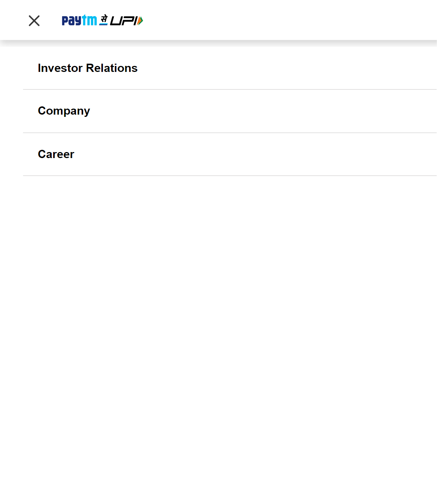

# **Paytm.com**

The project contains clone of website `Paytm.com` . This is a fully responsive clone of Paytm build purely with `React Js`. Utilised the efficient power of React Js to build this fully responsive clone. Learnt to use React Js to build production ready UI's in minimum time possible.

# Technologies Used
 `HTML`

 `CSS`

 `REACT`
# Features
 - Build over REACT
 - Clean and Beautiful UI Design
 - Fully Responsive Mobile Design
  # Link
Click [here](https://avinashchandra043.github.io/Clone1/) to run the app.
 # Website
 ## Desktop Version
 
 ## Mobile Version
 
 
  
 # Contact
 `https://www.linkedin.com/in/avinash-chandra-12540020b/`
 
 
 `avinashchandrabarik01@gmail.com`
